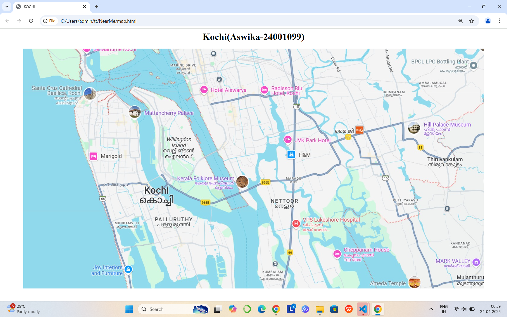
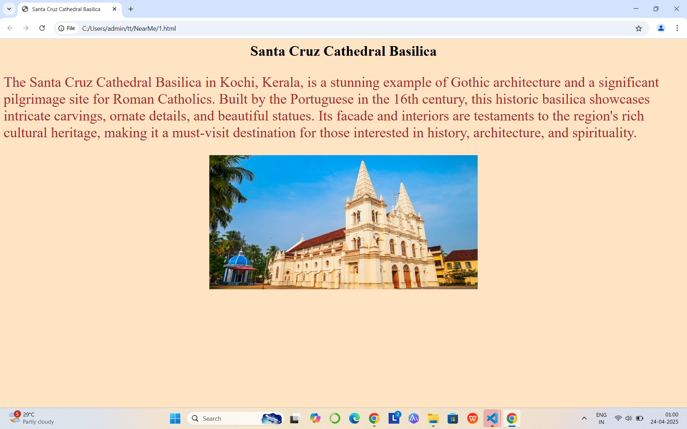
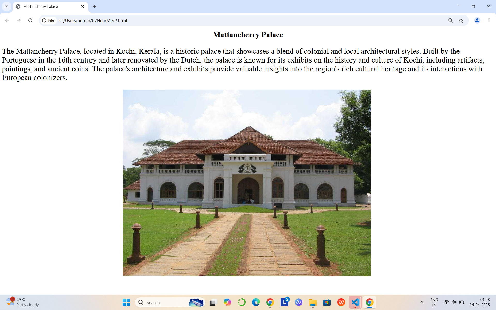
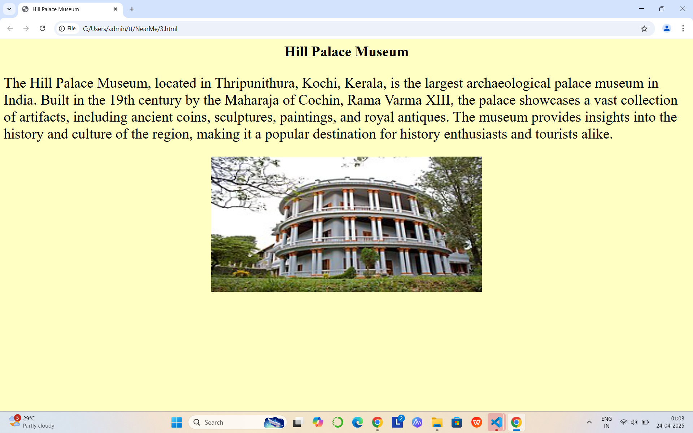
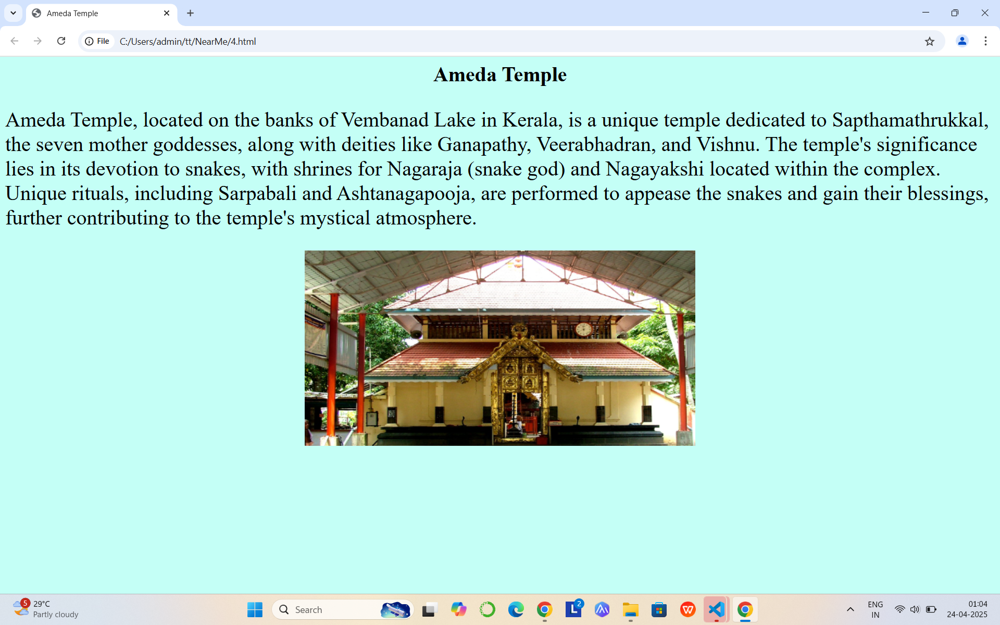
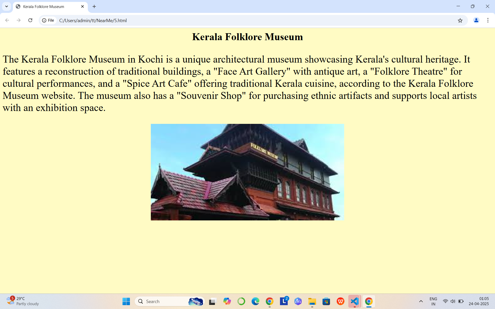

# Ex04 Places Around Me
## Date: 24.04.2024

## AIM
To develop a website to display details about the places around my house.

## DESIGN STEPS

### STEP 1
Create a Django admin interface.

### STEP 2
Download your city map from Google.

### STEP 3
Using ```<map>``` tag name the map.

### STEP 4
Create clickable regions in the image using ```<area>``` tag.

### STEP 5
Write HTML programs for all the regions identified.

### STEP 6
Execute the programs and publish them.

## CODE
### map.html
```

<html>
    <head>
        <title>
            KOCHI
        </title>
    </head>
    <body>
        <h1 align="center">Kochi(Aswika-24001099)</h1>
        <center>
            
            <map name="mapnew">
                <area target="" alt="Santa Cruz Cathedral Basilica" title="Santa Cruz Cathedral Basilica" href="1.html" coords="616,99,775,142" shape="rect">
                <area target="" alt="Mattancherry Palace" title="Mattancherry Palace" href="2.html" coords="263,71,61" shape="circle">
                <area target="" alt="" title="" href="3.html" coords="63,481,107,457,179,485,167,521,60,524" shape="poly">
                <area target="" alt="" title="" href="4.html" coords="589,179,41" shape="circle">
                <area target="" alt="" title="" href="5.html" coords="256,405,326,436,289,488,204,473,183,422" shape="poly">
            </map>
        </center>
    </body>
</html>

```
### 1.html

```

<html>
    <head>
        <title>
            Santa Cruz Cathedral Basilica
        </title>
        <style>
            p{
                font-size: xx-large;
                color: brown;
                
            }
            body{
                background-color:bisque;
            }
        </style>
    </head>
    <body>
        <h1 align="center">Santa Cruz Cathedral Basilica</h1>
        <p>
The Santa Cruz Cathedral Basilica in Kochi, Kerala, is a stunning example of Gothic architecture and 
a significant pilgrimage site for Roman Catholics. Built by the Portuguese in the 16th century, this 
historic basilica showcases intricate carvings, ornate details, and beautiful statues. Its facade and 
interiors are testaments to the region's rich cultural heritage, making it a must-visit destination for 
those interested in history, architecture, and spirituality.
        </p>
        <center>
            
        </center>
    </body>
</html>

```

### 2.html

```

<html>
    <head>
        <title>
            Mattancherry Palace
        </title>
        <style>
            p{
                font-size: xx-large;
                color: black;
            }        
        </style>
    </head>
    <body>
        <h1 align="center">
            Mattancherry Palace
        </h1>
        <p>
The Mattancherry Palace, located in Kochi, Kerala, is a historic palace that showcases a blend
of colonial and local architectural styles. Built by the Portuguese in the 16th century and later 
renovated by the Dutch, the palace is known for its exhibits on the history and culture of Kochi, 
including artifacts, paintings, and ancient coins. The palace's architecture and exhibits provide 
valuable insights into the region's rich cultural heritage and its interactions with European colonizers.
        </p>
        <center>
            
    </body>
</html>

```
### 3.html

```
<html>
    <head>
        <title>
            Hill Palace Museum
        </title>
        <style>
            p{
                font-size: xx-large;
                color: black;
                
            }
            body{
                background-color:rgb(255, 255, 196);
            }
        </style>
    </head>
    <body>
        <h1 align="center">Hill Palace Museum</h1>
        <p>
The Hill Palace Museum, located in Thripunithura, Kochi, Kerala, is the largest archaeological palace 
museum in India. Built in the 19th century by the Maharaja of Cochin, Rama Varma XIII, the palace 
showcases a vast collection of artifacts, including ancient coins, sculptures, paintings, and royal 
antiques. The museum provides insights into the history and culture of the region, making it a popular 
destination for history enthusiasts and tourists alike.
        </p>
        <center>
            
        </center>
    </body>
</html>
```
### 4.html
```
<html>
    <head>
        <title>                                                                                                                                                                                                  Ameda Temple
        </title>
        <style>
            p{
                font-size: xx-large;
                color: black;
                
            }
            body{
                background-color:rgb(196, 255, 246);
            }
        </style>
    </head>
    <body>
        <h1 align="center">Ameda Temple</h1>
        <p>
 Ameda Temple, located on the banks of Vembanad Lake in Kerala, is a unique temple
 dedicated to Sapthamathrukkal, the seven mother goddesses, along with deities like 
 Ganapathy, Veerabhadran, and Vishnu. The temple's significance lies in its devotion 
 to snakes, with shrines for Nagaraja (snake god) and Nagayakshi located within the 
 complex. Unique rituals, including Sarpabali and Ashtanagapooja, are performed to 
 appease the snakes and gain their blessings, further contributing to the temple's 
 mystical atmosphere. 
        </p>
        <center>
            
        </center>
    </body>
</html>
```
### 5.html

```
<html>
    <head>
        <title> Kerala Folklore Museum                                                                                                                                                                                               
        </title>
        <style>
            p{
                font-size: xx-large;
                color: black;
                
            }
            body{
                background-color:rgb(255, 251, 196);
            }
        </style>
    </head>
    <body>
        <h1 align="center">Kerala Folklore Museum</h1>
        <p>
The Kerala Folklore Museum in Kochi is a unique architectural museum showcasing Kerala's cultural heritage.
It features a reconstruction of traditional buildings, a "Face Art Gallery" with antique art, a 
"Folklore Theatre" for cultural performances, and a "Spice Art Cafe" offering traditional Kerala cuisine, 
according to the Kerala Folklore Museum website. The museum also has a "Souvenir Shop" for purchasing ethnic 
artifacts and supports local artists with an exhibition space. 
        </p>
        <center>
            
        </center>
    </body>
</html>

```
## OUTPUT








## RESULT
The program for implementing image maps using HTML is executed successfully.
